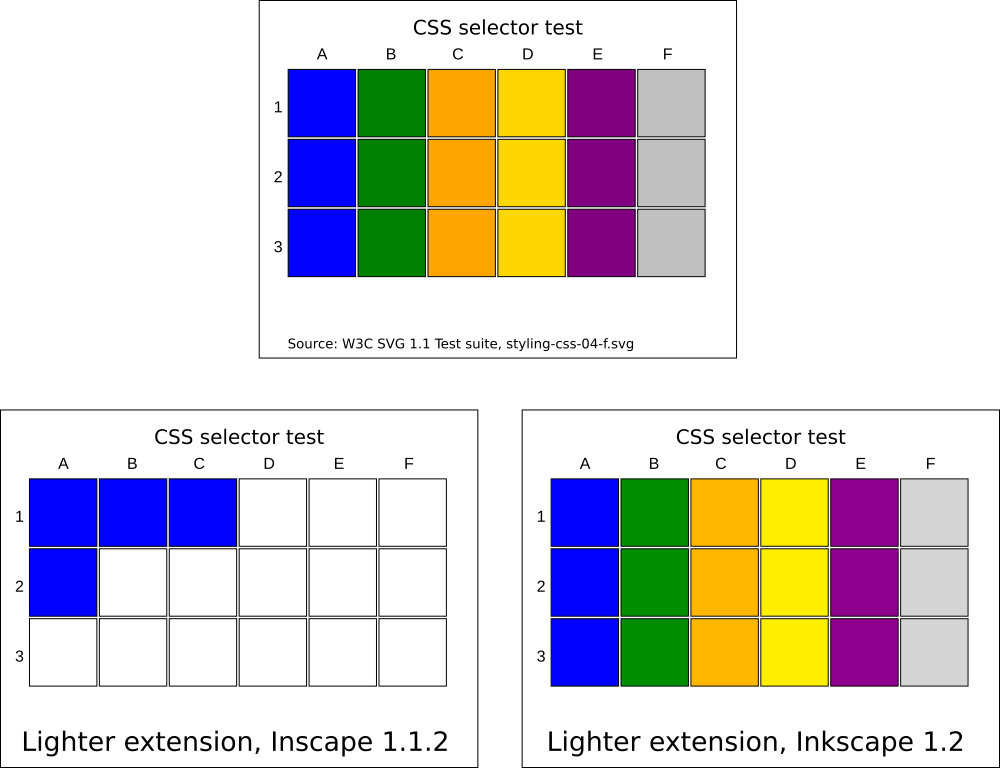

Updating your extension for Inkscape 1.2
=========================================

This page is intended for extension authors who want to use the new
capabilities of inkex in Inkscape 1.2. As of the Release of 1.2alpha
(Feb 5, 2022), no more breaking changes will be introduced until the
final release of 1.2.

There are no breaking changes in this release, but a few methods have
been deprecated.

.. _deprecating_changes:

Deprecating changes
-------------------

-  The Transforms multiplication operator has been changed from ``*``
   (``*=``) to ``@`` (``@=``), in accordance with
   `PEP-465 <https://www.python.org/dev/peps/pep-0465/>`__ (`MR
   extensions#389 <https://gitlab.com/inkscape/extensions/-/merge_requests/389>`__,
   `Issue
   extensions#327 <https://gitlab.com/inkscape/extensions/-/issues/327>`__)
-  ``svg.width`` and ``svg.height`` have been deprecated, and replaced
   with ``svg.viewbox_width``, ``svg.viewport_width``,
   ``svg.viewbox_height`` and ``svg.viewport_height``, see `New Units
   API <Updating_your_Extension_for_1.2#New_Units_API>`__.
-  ``selection.paint_order`` has been renamed to
   ``selection.rendering_order`` to be conformant with the specification
   (`MR
   extensions#344 <https://gitlab.com/inkscape/extensions/-/merge_requests/344>`__,
   `Issue
   extensions#310 <https://gitlab.com/inkscape/extensions/-/issues/310>`__)
-  ``FallbackStyle`` has been deprecated in favor of ``Style``, see `New
   Style API <Updating_your_Extension_for_1.2#New_Style_API>`__.

.. _new_style_api:

New Style API
-------------

   
    Top: W3C SVG1.1 Test suite,
    test `styling-css-04-f.svg <https://www.w3.org/Graphics/SVG/Test/20110816/harness/htmlObjectApproved/styling-css-04-f.html>`__.
    This test includes various CSS selectors, and includes group inheritance
    and pseudo-selectors. It is rendered correctly in Inkscape 1.2. Bottom
    left: Output of the "Lighter" extension in Inkscape 1.1.2, only two
    squares are processed correctly, two squares have a wrong color and the
    other 14 raise unhandled exceptions. Bottom right: Correct output in
    Inkscape 1.2. This shows that inkex correctly handles different types of
    CSS selectors.
    
Added in `MR
extensions#294 <https://gitlab.com/inkscape/extensions/-/merge_requests/294>`__,
`MR
extensions#296 <https://gitlab.com/inkscape/extensions/-/merge_requests/296>`__,
`MR
extensions#298 <https://gitlab.com/inkscape/extensions/-/merge_requests/298>`__,
`MR
extensions#300 <https://gitlab.com/inkscape/extensions/-/merge_requests/300>`__,
`MR
extensions#352 <https://gitlab.com/inkscape/extensions/-/merge_requests/352>`__,
`MR
extensions#403 <https://gitlab.com/inkscape/extensions/-/merge_requests/403>`__

Inkex now exposes styles to extensions authors as intended by the SVG
specification. This means:

-  ``BaseElement`` now has functions ``cascaded_style``,
   ``specified_style`` and ``presentation_style``.
-  In most use cases, extensions querying a style will use
   ``specified_style``. This computes the `effective
   style <https://www.w3.org/TR/CSS22/cascade.html#specified-value>`__
   of the element, including CSS classes / pseudo-selectors, inherited
   styles, presentation attributes etc.
-  While ``style.get()`` and ``style[key]`` has been unchaged, a new
   getter has been added in form of ``style(key)`` (similar to a
   function call), which attempts to parse the attribute in a reasonable
   datatype. If the attribute is unset, the (parsed) default value will
   be returned. For example:

   -  ``style("fill")`` returns a ``Color`` / ``Gradient`` / ``Pattern``
      / ``None``,
   -  ``style("opacity")`` returns a value between 0 and 1, regardless
      if opacity is defined as percentage or as float, is out of bounds
      or undefined,
   -  ``style("stroke-dasharray")`` returns a list of floats of
      dash/gap/dash/gap in user units.

-  Not for all attributes there is a parser defined - in that case, a
   string will be returned. Additional parsers may be added in the
   future, so if you handle the string value, typecheck it first!

.. _using_the_new_style_api_in_your_extension:

Using the new Style API in your extension
~~~~~~~~~~~~~~~~~~~~~~~~~~~~~~~~~~~~~~~~~

The following calls can probably be simplified:

+----------------------------------------------------+----------------------------------------------------+
| Old code (pre-1.2)                                 | New code (1.2+)                                    |
+====================================================+====================================================+
| .. code:: python3                                  | .. code:: python3                                  |
|                                                    |                                                    |
|    if "fill-opacity" in self.style:                |    alpha = self.style("fill-opacity")              |
|        alpha = self.style["fill-opacity"]          |                                                    |
|    else:                                           |                                                    |
|        alpha = 1                                   |                                                    |
+----------------------------------------------------+----------------------------------------------------+
| .. code:: python3                                  | .. code:: python3                                  |
|                                                    |                                                    |
|   if not node.style.get(attr, '')\                 |    marker_node = node.style(attr)                  |
|           .startswith('url(#'):                    |                                                    |
|       continue                                     |                                                    |
|                                                    |                                                    |
|   marker_id = node.style[attr][5:-1]               |                                                    |
|   marker_node = self.svg.getElement(               |                                                    |
|       f'/svg:svg//svg:marker[@id="{marker_id}"]')  |                                                    |
+----------------------------------------------------+----------------------------------------------------+
| .. code:: python3                                  | .. code:: python3                                  |
|                                                    |                                                    |
|   obj.style['fill'] = pattern.get_id(2)            |    obj.style['fill'] = pattern                     |
+----------------------------------------------------+----------------------------------------------------+

Checkout `MR
extensions#298 <https://gitlab.com/inkscape/extensions/-/merge_requests/298>`__
for additional examples of simplifications.

.. _new_units_api:

New Units API
-------------

Added in `MR
extensions#329 <https://gitlab.com/inkscape/extensions/-/merge_requests/329>`__,
`MR
extensions#343 <https://gitlab.com/inkscape/extensions/-/merge_requests/343>`__,
`MR
extensions#415 <https://gitlab.com/inkscape/extensions/-/merge_requests/415>`__

The existing functions ``unittouu`` and ``uutounit`` are widely used,
but for different purposes. Different extension authors try to answer
different questions using these function, and, inevitably, some answers
were incorrect (see linked issues in `MR
extensions#329 <https://gitlab.com/inkscape/extensions/-/merge_requests/329>`__).

In Inkscape 1.2, new methods have been added to make working with
dimensional values easier. These are ``to_dimensionless``,
``to_dimensional``, ``viewport_to_unit`` and ``unit_to_viewport``. The
existing functions ``unittouu`` and ``uutounit`` are not deprecated, but
discouraged; in most cases, the new functions are more reliable.

-  ``to_dimensionless(value)`` fulfills the following task: **Convert
   this string from the XML into a number, while processing the unit.
   When using this function on any SVG attribute and replace the
   original value with the result, the output doesn't change visually.**
-  ``viewport_to_unit(value, target_unit="px")`` answers the following
   questions:

   -  **What is the length (e.g. the length of a rectangle, without a
      unit) of an object that has size** ``value`` **on the viewport?** This
      is relevant because in Inkscape toolbars / tools, all dimensions
      are shown in "viewport units".
   -  In other words: **What is the SVG representation of entering
      ``value`` in the width/height widget of the selection tool (set to
      the unit of value)?** Consider ``<svg width="210mm" viewBox="0 0 105 147.5"><rect width="100" height="100"/></svg>``
      , i.e. a "mm-based" SVG with scale=2. When typing ``200`` in the
      rectangle tool, set to mm, the XML editor shows ``100`` =
      ``100px``. That's what ``viewport_to_unit("200mm") = 100`` does.

   -  Note that this is different than
      ``viewport_to_unit("200", "mm")``, which would be for a rectangle
      with a width (in the width/height widget of the rectangle tool) of
      200 (px), while writing the width in ``mm`` *in the SVG*: \ 
      ``<rect width="7.00043mm" height="7.00043mm"/>``.

-  ``to_dimensional`` simply converts a float to its equivalent with
   attached unit. It's the opposite of ``to_dimensionless``.
-  ``unit_to_viewport(value, unit="px")`` answers the following
   question: **What does the the width/height widget of the selection
   tool (set to** ``unit`` **) show when selecting an element with width
   ``value`` as defined in the SVG?** Consider again ``<svg width="210mm" viewBox="0 0 105 147.5"><rect width="100" height="100"/></svg>``
   , i.e. a "mm-based" document with scale=2. To create this rectangle,
   one has to type ``viewport_to_unit("100", unit="mm") = 200`` into the
   rectangle tool, if the rectangle tool is set to mm.

With the same spirit, the functions for width/height of the document
have been updated. ``svg.width`` and ``svg.height`` have been
deprecated, and replaced with ``svg.viewbox_width``,
``svg.viewport_width``, ``svg.viewbox_height`` and
``svg.viewport_height``.

There is also ``svg.scale``, which returns the ratio of the viewport and
viewbox width, and ``svg.inkscape_scale`` which is the scale reported in
the Document properties dialog.

See :ref:`units` for additional information.

.. _other_additions_to_inkex:

Other additions to inkex
------------------------

-  The path conversion for arcs and stars have been added, so when
   extensions create these objects, they are rendered in a browser as
   well and can be processed further by the same extension. (`MR
   extensions#387 <https://gitlab.com/inkscape/extensions/-/merge_requests/387>`__,
   `Issue
   extensions#240 <https://gitlab.com/inkscape/extensions/-/issues/240>`__)
-  ``ColorExtension``\ s can now process in RGBA space. Previously,
   opacity and color were processed independently. By setting the class
   variable ``pass_rgba = True``, the ``modify_color`` method gets
   passed a color with alpha channel computed from matching property
   pairs, e.g. ``fill`` and ``fill-opacity``. (This value takes CSS
   styling and style inheritance into account. (`MR
   extensions#392 <https://gitlab.com/inkscape/extensions/-/merge_requests/392>`__
   , `Issue
   extensions#419 <https://gitlab.com/inkscape/extensions/-/issues/419>`__).
-  API functions for the new `multipage
   feature <Release_notes/1.2#Page_tool>`__ have been added: `MR
   extensions#499 <https://gitlab.com/inkscape/extensions/-/merge_requests/399>`__.

.. _other_deprecations_to_inkex_1_2

Other deprecations to inkex
----------------------------

- Pre Inkscape 1.0 way of declaring the dependency on inkex in the ``*.inx`` file has been removed entirely. (It was deprecated in Inkscape 1.0. For details, see :ref:`remove_dependency_listings`)

