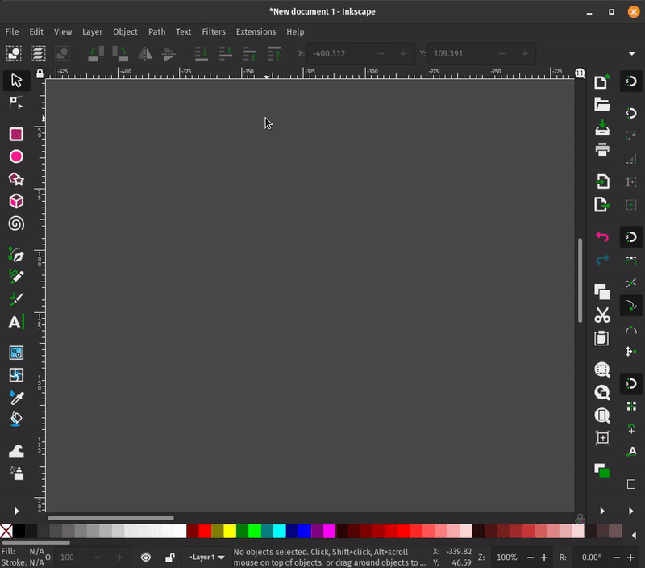
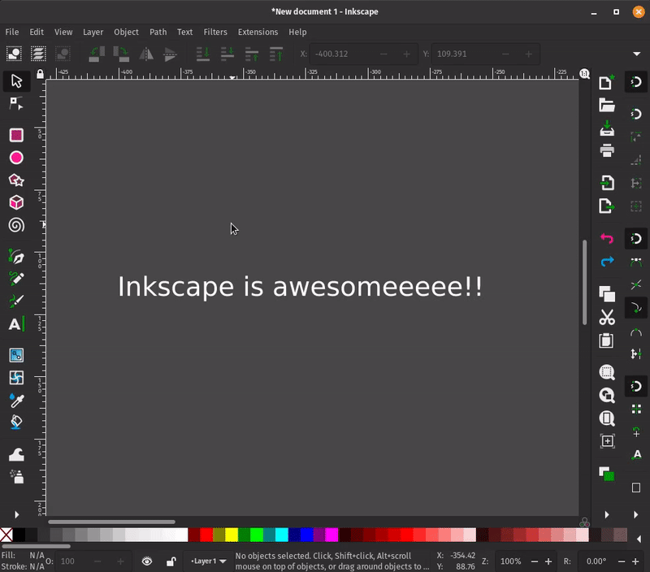

My first text extension
=======================

This article will teach you the basics of writing a Text Extension for
Inkscape using the ``inkex`` Extensions API.

Introduction
------------

Any extension that manipulates text in any way is a Text Extension. Text
Extensions can broadly be categorized in two types based on the type of
manipulation they do to text:

1. **Manipulating the text itself** - like changing case.
2. **Changing attributes of the text** like font, color, size, etc.
   There can also be extensions which are a hybrid of both the above
   types.

In this article we will create an extension named ``Stronger Text``. It
is a *Type 2* Text Extension and it will make the selected text bold and
it will also italicize it. We will also see an example of creating a
*Type 1* Text Extension.

.. hint:: 
     
     This article assumes you create all files in the User Extensions
     directory which is listed at
     ``Edit``>\ ``Preferences``>\ ``System`` - ``User Extensions:`` in
     Inkscape. 

Step 0 : The Boilerplate 
------------------------

Like any other Inkscape extension, this extension will also have two files. 
So, create a ``stronger_text.inx`` file and a ``stronger_text.py`` file.

- ``stronger_text.inx``: It will have the necessary information
  for Inkscape to be able to recognize your extension as a valid
  Inkscape extension. It will also have the declaration of any
  interface for your extension. 
- ``stronger_text.py``: It will have
  the actual Python code your extension will execute.

.. hint::

   There is another file that is worth mentioning here - the **test**
   file which in our case will be ``test_stronger_text.py``. It is not
   required to be present for an extension per se, but as a best
   practice, the extension code should always be accompanied by test
   code.

Step 1 : Populate the ``*.inx`` file
------------------------------------

Our extension **Stronger Text** will have a very basic ``.inx`` file.

.. code:: xml

   <?xml version="1.0" encoding="UTF-8"?>
   <inkscape-extension xmlns="http://www.inkscape.org/namespace/inkscape/extension">
     <name>Stronger Text</name>
     <id>org.inkscape.text.strongertext</id>
     <effect>
       <object-type>all</object-type>
       <effects-menu>
         <submenu name="Text">
         </submenu>
       </effects-menu>
     </effect>
     
   </inkscape-extension>

Explanation
~~~~~~~~~~~

The lines below help Inkscape uniquely identify our extension so that it
can be displayed under the **Extensions** menu. You should modify these
two lines for your own extension:

.. code:: xml

   [...]
     <name>Stronger Text</name>
     <id>org.inkscape.text.strongertext</id>
   [...]

Towards the end of the ``.inx`` file, we change the submenu to ``Text``.
It specifies that this extension should be listed in the **Text**
submenu under the **Extensions** menu in Inkscape UI:

.. code:: xml

   [...]
     <effect>
         <object-type>all</object-type>
         <effects-menu>
           <submenu name="Text">
           </submenu>
         </effects-menu>
       </effect>
   [...]

Now - Save the file - Close any open Inkscape windows - Relaunch
Inkscape

After successfuly completing these steps, you should see the Stronger
Text extension in Inkscape UI.

   Inkscape Recognizes Our Extension

Currently it doesn’t do anything as we haven’t written anything in the
``stronger_text.py`` file.

Step 2 : Write the code in ``*.py`` file
----------------------------------------

First Things First
^^^^^^^^^^^^^^^^^^

To be able to use any extension functionality, you need to import the
``inkex`` module.

.. code:: py

   import inkex

Every Text Extension inherits from the :class:`~inkex.extensions.TextExtension` class provided
by the ``inkex`` API. Let’s name our class ``StrongerText`` (an
arbitrary name) and inherit the :class:`~inkex.extensions.TextExtension` class.

.. code:: py

   import inkex

   class StrongerText(inkex.TextExtension):
     #implement functionality here
     pass

The ``TextExtension`` class provides us with methods to manipulate the
text.

Our extension ``Stronger Text`` is a *Type 2* extension as it needs to
change the attributes of text. To get access to the attributes of the
text, we need to override the :func:`~inkex.extensions.TextExtension.process_element` method.

.. code:: py

   import inkex

   class StrongerText(inkex.TextExtension):
     def process_element(self, text_node):
           text_node.style["font-weight"] = "bold"
           text_node.style["font-style"] = "italic"
           #text_node.style["attribute-name"] = "value"

   StrongerText().run()

.. _explanation-1:

Explanation
~~~~~~~~~~~

| ``text_node.style`` provides us with a dictionary (technically it’s an
  ``OrderedDict``) which we can use to change the attributes of the text
  by using the attribute name as a key.
| When a standard inkex-based Text Extension is run, it will call a
  method called :func:`~inkex.extensions.TextExtension.effect` on the ``TextExtension`` class which then
  eventually calls our(``StrongerText``\ ’s) ``process_element``
  function. \**\* If your extension is a *Type 1* Text Extension, i.e,
  it’s purpose is to take text from Inkscape, transform/manipulate it,
  and return it to Inkscape, you just need to override the
  :func:`~inkex.extensions.TextExtension.process_chardata` function like so:

.. code:: py

   import inkex

   class UpperCase(inkex.TextExtension):
     def process_chardata(self, text):
       # do some more manipulations here if you want
       return text.upper()

   UpperCase().run()

.. _explanation-2:

Explanation
~~~~~~~~~~~

The ``text`` parameter in the :func:`~inkex.extensions.TextExtension.process_chardata` function receives
the text from Inkscape as a Python string. In the :func:`~inkex.extensions.TextExtension.process_chardata`
function itself, we can manipulate the string in any way to our
liking. We then return the manipulated string.

Infact, if you’ve used the ``UPPERCASE`` extension in Inkscape from 
the ``Extensions``>\ ``Text``>\ ``Change Case`` submenu, it is
identical to the Extension we just wrote! 
  
.. hint::

  This *Type 1* Extension
  will have an almost identical ``.inx`` file with changes in places
  like the ``<name>`` and ``<id>`` tags and a separate ``.py`` file with
  the above code in it.

Moment of Truth
---------------

Now, we should test our extension to see it in action. - Select some
Text (preferably a font that has bold and italics styles available) -
Click on the **Stronger Text** extension

The result should appear like this:

   Did It Work? (yes, indeed)
