.. _inx-widgets:

INX widgets and parameters
==========================

This page contains the reference documentation for INX widgets and
parameters. Their primary goal is to make it easy to design GUIs for
`Inkscape Extensions <Extension_subsystem>`__ using the built-in `INX
extension descriptor format <INX_extension_descriptor_format>`__,
although (invisible) parameters can also be used for extensions that
don't need to show a user interface.

Introduction
------------

Extension GUIs consists of an arbitrary number of GUI elements,
so-called `Widgets <#Widgets>`__. These can be simple text labels, boxes
and spacers to control layout or more complex UI elements like images.

A special class of Widgets are `Parameters <#Parameters>`__. They differ
from other Widgets in that they have a user-settable value, for example
a boolean (implemented as checkbox) or integer (implemented as number
entry). The value of each Parameter is passed to the extension on
execution and can be used to control its behavior.

All Widgets are described using an easy-to-learn XML schema with
predefined tags and attributes which are described in detail below.

.. _available_widgets:

Available Widgets
~~~~~~~~~~~~~~~~~

A general Widget takes the form

.. code::

     <widget_name attribute1="value1" attribute2="value2" ...>value</widget_name>

where ``widget_name`` specifies the name of the widget and is one of the
following:

-  ``label``:sup:`since 1.0`\ 
-  ``hbox``:sup:`since 1.0`\ /``vbox``:sup:`since 1.0`\ 
-  ``separator``:sup:`since 1.0`\ /``spacer``:sup:`since 1.0`\ 
-  ``image``:sup:`since 1.0`\ 
-  ``param`` (for all Parameter types)

.. _apt:

Available Parameter types
~~~~~~~~~~~~~~~~~~~~~~~~~

A general Parameter takes the form

.. code:: 

     <param type="parameter_type" attribute1="value1" atribute2="value2" ...>value</param >

where ``parameter_type`` specifies the type of the parameter and is one
of the following:

-  ``bool``:sup:`since 1.0`\ 
-  ``int``
-  ``float``
-  ``string``
-  ``path``:sup:`since 1.0`\ 
-  ``optiongroup``
-  ``notebook``
-  ``color``

If a parameter is made invisible (see ``gui-hidden`` attribute in the
`next section <#common-attributes>`__) it will not be shown in the GUI
but it's value is still passed to an extension. This is useful if you
want to hardcode parameter value the user should not be able to change.
If all parameters (and potential widgets) are invisible, Inkscape will
not show a GUI and execute the extension immediately instead, but will
still pass the values of the invisible parameters.

.. _common_attributes:

Common attributes
-----------------

For all widgets
~~~~~~~~~~~~~~~

+------------------+------------------+------------------+------------------+
| Attribute        | Allowed          | Default          | Required?        |
| name             | value(s)         | value            |                  |
+==================+==================+==================+==================+
| ``gui-hidden``   | ``true``,        |                  |                  |
|                  | ``false``        | ``false``        | optional         |
+------------------+------------------+------------------+------------------+
| If set to ``true`` the Widget is hidden from the GUI (primarily used to   |
| add hidden parameters that are passed to the extension but are not        |
| supposed to be editable by the user.)                                     |
|                                                                           |
| *Note: If there are* **no** *visible parameters defined in a GUI, the     |
| extension is executed immediately without showing a dialog.*              |
+------------------+------------------+------------------+------------------+
| ``indent``       | ``0,1,2,…``      | ``0``            | optional         |
+------------------+------------------+------------------+------------------+
| Sets indentation level of the parameter. Increasing indentation adds      |
| padding to the start of the line.                                         |
+------------------+------------------+------------------+------------------+

Only for Parameters
~~~~~~~~~~~~~~~~~~~

+------------------------+------------------------+------------------------+------------------------+
| Attribute name         | Allowed value(s)       | Default value          | Required?              |
+========================+========================+========================+========================+
| ``name``               | *(text)*               | --                     | required               |
+------------------------+------------------------+------------------------+------------------------+
| Used as an identifier of the parameter. It has to be unique since the value of this attribute is  |
| used to save and transmit parameter values internally!                                            |
+------------------------+------------------------+------------------------+------------------------+
| ``type``               | see `above <#apt>`__   | --                     | required               |
+------------------------+------------------------+------------------------+------------------------+
| Determines the type of the parameter, see the extensive description of                            |
| `Parameters <#parameters>`__ below.                                                               |
+------------------------+------------------------+------------------------+------------------------+
| ``gui-text``           | *(text)*               | --                     | required *(visible     | 
|                        |                        |                        | parameters)*, optional |
|                        |                        |                        | *(hidden parameters* + |
|                        |                        |                        | ``notebooks`` *)*      |
+------------------------+------------------------+------------------------+------------------------+
| Label shown for the parameter in the GUI.                                                         |
+------------------------+------------------------+------------------------+------------------------+
| ``gui-description``    | *(text)*               | --                     | optional               |
+------------------------+------------------------+------------------------+------------------------+
| Tooltip shown for the parameter when the user hovers the mouse cursor over the active area of the |
| parameter in question.                                                                            |
+------------------------+------------------------+------------------------+------------------------+

Widgets
-------

``hbox`` / ``vbox``
~~~~~~~~~~~~~~~~~~~

Creates a container for other widgets. No visual rendering but provides a possibility to align and 
layout other widgets. Child widgets are either added in horizontal (``hbox``) or vertical 
(``vbox``) direction.

 .. code:: xml

    <hbox>…</hbox>
    <vbox>…</vbox>

A box can contain an arbitrary number of other widgets and parameters (including other boxes) to 
fine-tune the layout of the GUI.

*Note*: When you start with an empty extension GUI, you're basically starting with a ``vbox``.
Also ``notebook`` pages behave like vertically oriented boxes.

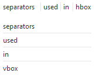

   ``hbox`` and ``vbox``

``image``
~~~~~~~~~

Creates a widget displaying an image. The content of the node specifies
the path of the image file (ideally specify a path relative to the .inx
file itself).

.. code:: xml

   <image>path/to/image.svg</image>

By default the image will be rendered at it's actual size. Use
attributes ``width/heigth`` to override the default size (in this case
*both* attributes need to be supplied; units are pixels).

Images are aligned in the horizontal center of the current box; different alignment
can be realized by wrapping the image in a `hbox <#hbox-vbox>`__ and adding a 
`spacer <#spacer>`__ with ``size="expand"``
before (for right alignment) or after (for left alignment) of the image.

*Implementation note: Loadable image formats are determined by GdkPixbuf
and therefore system-specific. PNG should always work and is the safe
choice. SVG should mostly work and is the preferred choice for obvious
reasons.*

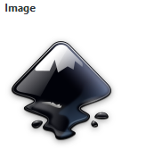

   An ``image``

``label``
~~~~~~~~~

Creates a widget showing text. The content of the node corresponds to
the text content that will be rendered.

.. code:: xml

   <label>Some text here.</label>

*Note: Labels are intended to provide additional information / help. For
labeling parameters use the* ``gui-text`` *attribute; for short help texts
that are specific to a single parameter prefer* ``gui-description`` *which
will render as a tooltip.*

-  When setting the attribute ``appearance="header"`` the text is styled
   as a heading and can be used as another possibility to group
   parameters.
-  | When setting the attribute ``appearance="url"`` the text is rendered
     as a clickable link.
   | *Note: The text is escaped and used as the link target as-is.
     Creating a link text that differs from the URL is prevented for
     security reasons.*
-  When setting the attribute ``xml:space="preserve"`` any white-space
   (spaces, tabs, line-breaks, etc.) in the label will be preserved,
   allowing to format the label accordingly. By default all
   leading/tailing and intermediary whitespace is collapsed into a
   single space character.

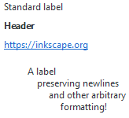

   Different label types (in order): default | ``appearance="header"`` | 
   ``appearance="url"`` | ``xml:space="preserve"``

``separator``
~~~~~~~~~~~~~

Creates a separator for visual separation of other widgets. Renders as a
horizontal/vertical line.

.. code:: xml

   <separator />

The direction of the separator will automatically adjust depending on
direction of the current container (vertical for "empty" extension GUIs
and ``notebook`` pages; vertical/horizontal for ``vbox`` and ``hbox``
respectively).

   Separators can be used in `hbox` and `vbox` environments.

``spacer``
~~~~~~~~~~

Creates a spacer for visual separation of other widgets. No visual
rendering but provides variable spacing.

.. code:: xml

   <spacer />

The direction of the spacer will automatically adjust depending on
direction of the current container (vertical for "empty" extension GUIs
and ``notebook`` pages; vertical/horizontal for ``vbox`` and ``hbox``
respectively).

Use the ``size`` attribute to set the spacing in pixels (default:
``size="10"``). The special value ``expand`` results in a spacer that
grows dynamically and always uses up as much space as possible (useful
for aligning content).

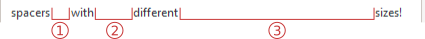

   Different spacer types: (1) default, (2) ``size="30"``, (3) ``size="expand"``

Parameters
----------

``bool``
~~~~~~~~

.. versionadded:: 1.0

Creates a checkbox to set a **boolean value**. Allowed values are
``true`` or ``false`` (default value: ``true``).

.. code:: xml

   <param name="name" type="bool" gui-text="Some label text">false</param>

   Rendering of ``boolean`` values

``color``
~~~~~~~~~

Creates a control to select an **RGBA color value**. Values should be
given in hexadecimal notation, e.g. ``0xff0000ff`` for red with full
opacity (default value: ``0x000000ff``)

.. code:: xml

   <param name="name" type="color" gui-text="Some label text">0x000000ff</param>

Use ``appearance="colorbutton"`` for a simple button that opens a
simplified color picker. Otherwise a full ColorNotebook will be
rendered.

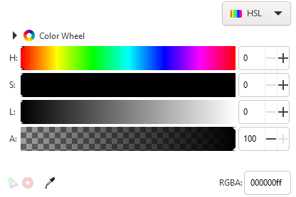

   Rendering of a full ColorNotebook for a ``color`` parameter

.. versionchanged:: 1.0

   *Implementation note:* colors values are internally treated as 32-bit
   unsigned integers (unsigned long). Acceptable default values include
   everything the standard library function ``strtoul`` [#]_ understands (since Inkscape 1.0).
   Earlier Inkscape version only handled decimal numbers. The value passed
   to the extension script will also be a decimal number.

``float``
~~~~~~~~~

Creates a input to enter a **floating point number**. Limit the input
range with the ``min`` and ``max`` attributes; set the number of decimal
places with the ``precision`` attribute. (defaults: ``min="0"``,
``max="10"`` and ``precision="1"``; default value: 0)

.. code:: xml

   <param name="name" type="float" precision="1" min="0" max="100" 
   gui-text="Float Parameter">1.234</param>

Use the attribute ``appearance="full"`` to create a slider with which
the value can be adjusted dynamically over the full range.

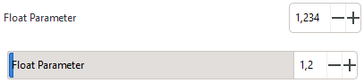

   Rendering of ``float`` parameters: default and with ``appearance="full"``. 
   On the bottom parameter, ``precision="1"`` has been set.

``int``
~~~~~~~

Creates a textbox input to enter an **integer number**. Limit the input
range with the ``min`` and ``max`` attributes. (defaults: ``min="0"``
and ``max="10"``; default value: 0)

.. code:: xml

   <param name="name" type="int" min="1" max="100" gui-text="Integer Parameter">1</param>

Use the attribute ``appearance="full"`` to create a slider with which
the value can be adjusted dynamically over the full range.

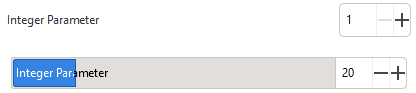

   Rendering of ``int`` parameters: default and with ``appearance="full"``

``notebook``
~~~~~~~~~~~~

Creates a set of pages (aka tab control). The user can switch between
individual pages. Each page can contain an arbitrary set of other
Widgets and Parameters. Individual pages are created with the element.

The **returned value** for ``notebook`` parameters is the value of the
``name`` attribute of the selected . By default the first page is
selected.

Notebooks can be used to show widgets based on an option; that option
would be implemented as notebook.

.. code:: xml

   <param name="name" type="notebook">
       <page name="page_1" gui-text="First page">
           …
       </page>
       <page name="page_2" gui-text="Second page">
           …
       </page>
   </param>

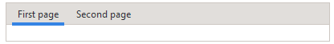

   Rendering of a ``notebook``

``optiongroup``
~~~~~~~~~~~~~~~

Creates a control that allows to select one option **one option** from a
set of multiple choices. The different choices are created with
elements.

The **returned value** for ``optiongroup`` type parameters is the value
of the ``value`` attribute of the selected . By default the first is
selected.

.. code:: xml

   <param name="name" type="optiongroup" appearance="radio/combo"
   gui-text="Some label text">
      <option value="1">First option</option>
      <option value="2">Second option</option>
   </param>

.. versionadded:: 1.0
   Set the attribute ``appearance="radio"``\  to render radio buttons
   (default). Set the attribute ``appearance="combo"``\  to display a
   drop-down list instead.

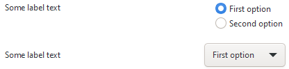

   Rendering of ``optionsgroup`` parameters: ``appearance="radio"`` and 
   ``appearance="combo"``. 

``path``
~~~~~~~~

.. versionadded:: 1.0

Creates a control to choose a **path**. Paths can either be entered
manually or by using the file chooser that can be opened using the
ellipsis button.

The ``mode`` attribute allows to set behavior of the file chooser (i.e.
if files or folders can be selected, if they need to exist previously
and if multiple selections are possible). The ``filetypes`` attribute
holds a comma-separated list of file extensions and restricts the
selectable file types in file picker mode.

.. code::

   <param type="path" name="varname" gui-text="label" mode="$mode" [filetypes="$filetypes"]/>

Possible values for the ``mode`` attribute:

-  ``file`` - select a single existing file
-  ``files`` - select multiple existing files
-  ``folder`` - select a single existing folder
-  ``folders`` - select multiple existing folders
-  ``file_new`` - select a single new file name
-  ``file_new`` - select a single new folder name

Examples

-  Files:

   -  Choose a file, with file type restriction (optional):
      
      .. code:: xml
      
         <param name="my_file" type="path" mode="file" filetypes="png,jpg" gui-text="A file:">my/path/to/file.png</param>
   -  Choose multiple files (file type restriction possible, too):
      
      .. code:: xml
         
         <param name="my_files" type="path" mode="files" gui-text="Multiple files:">my/path/to/file.png</param>
   -  Create a new file: 
      
      .. code:: xml

         <param name="my_new_file" type="path" mode="file_new" filetypes="png" gui-text="A new file:">my/path/to/file.png</param>

-  Folders:

   -  Choose a folder: 
      
      .. code:: xml
      
         <param name="my_folder" type="path" mode="folder" gui-text="A folder:">my/path/</param> 
   -  Choose multiple folders: 

      .. code:: xml

         <param name="my_folders" type="path" mode="folders" gui-text="Folders:">my/path/</param>
   -  Create a new folder: 
      
      .. code:: xml

         <param name="my_new_folder" type="path" mode="folder_new" filetypes="png" gui-text="A new folder:">my/path/</param>

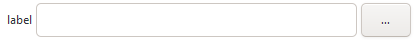

   Rendering of ``path`` parameters

*Implementation note:* Existence of paths are not checked before passing
them to the extension, so extension authors need to implement suitable
error handling, especially in case of manual path entry. For multiple
selections the individual paths are joined using the pipe character
("|") and passed to the extension as a single string.

``string``
~~~~~~~~~~

Creates a input to enter a **string**. Limit the number of characters
the user is allowed to enter with the ``max-length`` attribute.
(defaults: no character limit; default value: empty string)

.. code:: xml

   <param name="name" type="string" gui-text="Some text label">Some default text</param>

.. versionadded:: 1.0
   Set the attribute ``appearance="multiline"``\  to render a multi-line
   input. Line-breaks will be encoded as literal ``\n`` in the value passed
   to the extension.

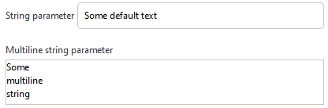

   Rendering of ``string`` parameters: default and 
   ``appearance="multiline"``

.. [#] https://en.cppreference.com/w/cpp/string/byte/strtoul