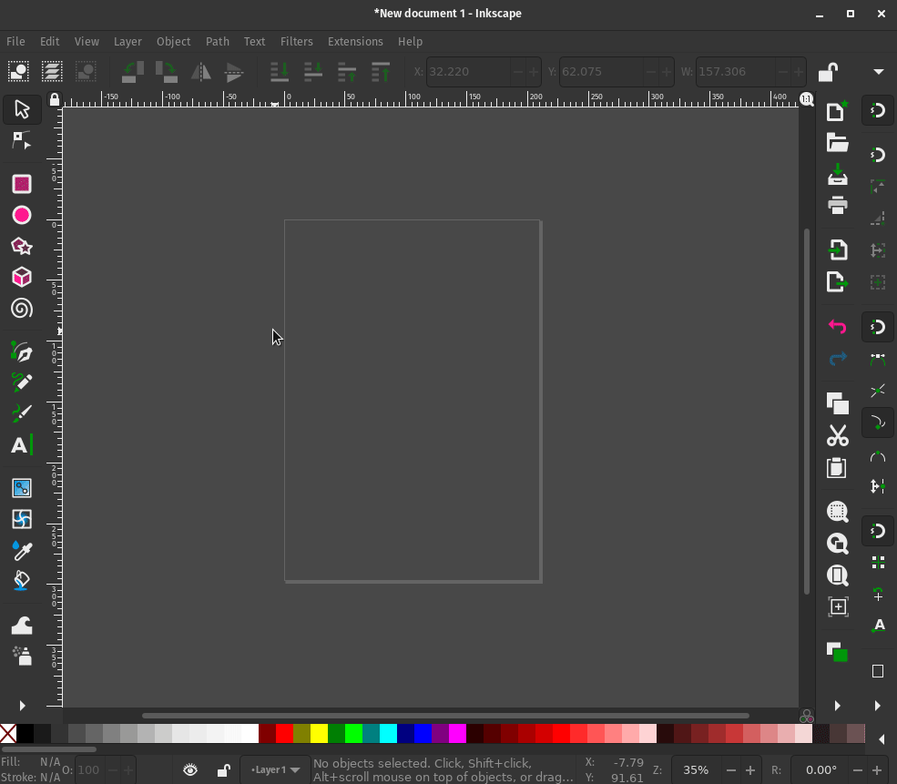
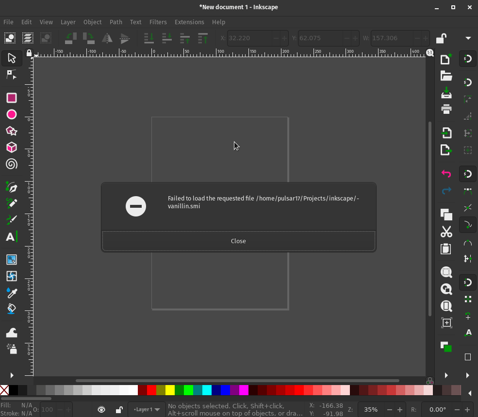
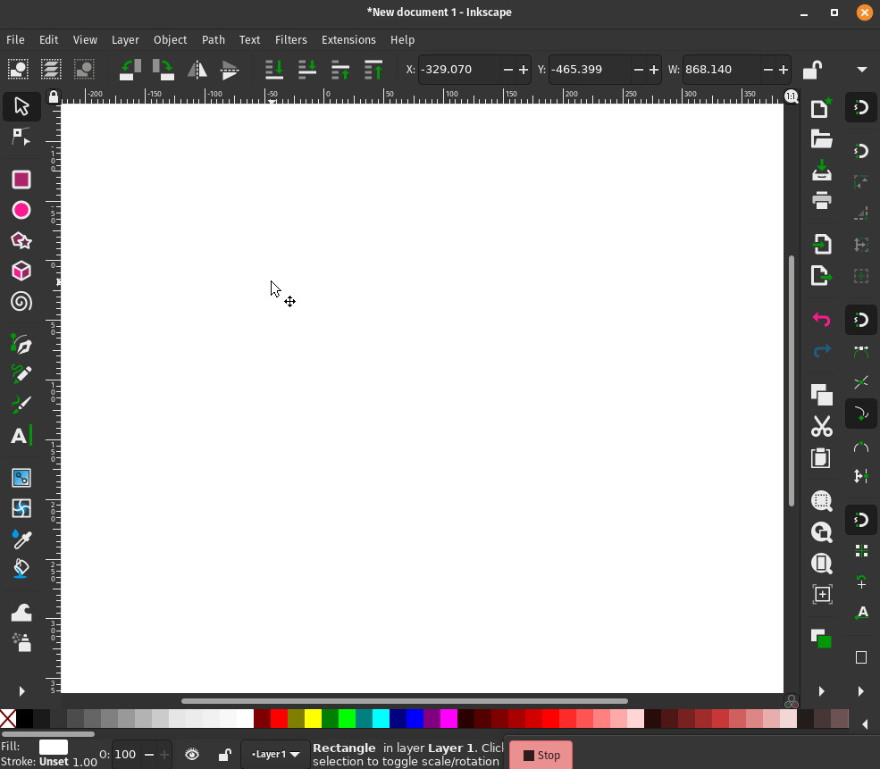

My first import extension
=========================

Resources
---------

:download:`vanillin.smi <resources/vanillin.smi>`

Introduction
------------

This article will teach you the basics of writing an Import Extension for
Inkscape using the ``inkex`` Extensions API.

Import Extensions are used to add support for a file format that
Inkscape does not support out of the box. It is rather complex to implement an entire file format,
but often there are already tools available to convert the file to a format that Inkscape can read, 
such as SVG or PDF. In this case, the extension depends on external programs that convert that 
specific file format to a svg that Inkscape can then read.

The way these extensions are used is not through the ``Extensions`` menu
but instead these provide options in\ ``File``>\ ``Open`` or
``File``>\ ``Import`` dialog.

The general flow of a Import Extension is as follows:

1) You select the specific file format from the File Format drop down
   menu of the ``File``>\ ``Open`` or ``File``>\ ``Import``\ dialog.
2) You select one or more files of that specific file format. You click
   on ``Open`` button.
3) Inkscape will then either open the svg file in a new window or will
   import it depending on which dialog of ``File`` menu was used.

.. hint::

   You can entirely skip 1) and 2) and just double click on
   the file. If your extension is set up correctly, you won’t notice the
   difference between opening a regular file and your file.

In this article we will create an extension named
``Organic Bond Visualizer``. It will produce the bond structure of an
organic compound given a
`SMILES <https://en.wikipedia.org/wiki/Simplified_molecular-input_line-entry_system>`__
file. The extension uses an external program called ``indigo-depict``
which has its GitHub repository
`here <https://github.com/epam/Indigo>`__. (It is a part of the
``indigo-utils`` package in Debian/Ubuntu repositories. For other
platforms you might need to build it from source.)

.. note:: A note on **PATH**

    Since the extension depends on external programs, it is important that
    these external programs can be found by our extensions. For that to
    happen, either these programs **should** be on your *system PATH* or an
    absolute path for the program should be used in the code.

    Depending on the operating system, the steps required for adding
    programs to the PATH might vary.

    You can get away with setting the PATH variable entirely by using an
    absolute path for the program but it is almost always a bad idea to
    hard-code paths in the code.

.. hint::

   This article assumes you create all extension related files in the
   User Extensions directory which is listed at
   ``Edit``>\ ``Preferences``>\ ``System`` - ``User Extensions:`` in
   Inkscape.

Step 0 : The Boilerplate
------------------------

Like any other Inkscape extension, this extension will also have two
files. So, create a ``organic_bond_vis.inx`` file and a
``organic_bond_vis.py`` file.

-  ``organic_bond_vis.inx`` - It will have the necessary information for
   Inkscape to be able to recognize your extension as a valid Inkscape
   extension. It will also have the info required to present the
   extension as an option in ``File``>\ ``Open`` or
   ``File``>\ ``Import`` dialog.
-  ``organic_bond_vis.py`` - It will have the actual Python code your
   extension will execute.

.. hint::

   There is another file that is worth mentioning here - the **test**
   file which in our case will be ``test_organic_bond_vis.py``. It is
   not required to be present for an extension per se, but as a best
   practice, the extension code should always be accompanied by test
   code.

Step 1 : Populate the ``*.inx`` file
------------------------------------

.. code:: xml

   <?xml version="1.0" encoding="UTF-8"?>
   <inkscape-extension xmlns="http://www.inkscape.org/namespace/inkscape/extension">
       <name>Organic Bond Visualizer</name>
       <id>org.inkscape.input.bondvisualizer</id>
       <dependency type="executable" location="path">indigo-depict</dependency>
       <input>
           <extension>.smi</extension>
           <mimetype>chemical/x-daylight-smiles</mimetype>
           <filetypename>SMILES(*.smi)</filetypename>
           <filetypetooltip>SMILES</filetypetooltip>
       </input>
       
   </inkscape-extension>

The lines below help Inkscape uniquely identify our extension. You
should modify these two lines for your own extension:

.. code:: xml

   [...]
     <name>Organic Bond Visualizer</name>
     <id>org.inkscape.input.bondvisualizer</id>
   [...]

Now we declare the dependency of our extension:

.. code:: xml

       <dependency type="executable" location="path">indigo-depict</dependency>

The ``<input>`` tag is what specifies that this extension should add a
new format in the list of available file formats Inkscape can
open/import.

.. code:: xml

   [...]
       <input>
              <extension>.smi</extension>
              <mimetype>chemical/x-daylight-smiles</mimetype>
              <filetypename>SMILES(*.smi)</filetypename>
              <filetypetooltip>SMILES</filetypetooltip>
       </input>
   [...]

Inside the ``<extension>`` tag we declare the suffix of our new format
(including ``.``)

Some more examples of suffixes could be ``.ps`` , ``.fig``, etc. The
text inside ``<filetypename>`` is what appears in the
``File``>\ ``Open`` or ``File``>\ ``Import`` dialogs.

Towards the end, we add the name of our ``.py`` file inside the
``<command>`` tag.

.. code:: xml

   [...]
     
   [...]

Now

-  Save the file
-  Close any open Inkscape windows
-  Relaunch Inkscape

You should now see a ``SMILES(*.smi)`` option in the drop down menu.

   Smiles_Format

If you were to select the ``vanillin.smi`` file and open it, you would
get an error saying:

   Call_Extension_Failure

This is because we haven’t written anything in the ``.py`` file of our
extension.

Step 2 : Write the code in ``*.py`` file
----------------------------------------

First Things First
~~~~~~~~~~~~~~~~~~

To be able to use any extension functionality, you need to import the
``inkex`` module.

.. code:: python

   import inkex

There is a specialized class for input extensions that only call an external program to
convert the file. Every Call Extension inherits from the :class:`~inkex.extensions.CallExtension` 
class provided by the ``inkex`` API. Let’s name our class ``OrganicBondVisualizer`` (an
arbitrary name) and inherit the :class:`~inkex.extensions.CallExtension`  class.

.. code:: python

   import inkex

   class OrganicBondVisualizer(inkex.CallExtension):
     #implement functionality here
     pass

Specify the formats
~~~~~~~~~~~~~~~~~~~

We now specify the input file format and output file format. (both
without the ``.``). The output file format by default is ``svg``.

.. code:: python

   import inkex
   from inkex import command

   class OrganicBondVisualizer(inkex.CallExtension):

       input_ext = 'smi'
       output_ext = 'svg'

       #implement functionality here
       pass

Override
~~~~~~~~

To be able to call an another program, we need to override the :func:`~inkex.extensions.CallExtension.call`
function in our class. We need to import the :mod:`~inkex.command` module as it
contains the actual implementation to call external programs. Inside the
overridden method we call :mod:`~inkex.command` module’s :func:`~inkex.command.call` function.

.. code:: python

   import inkex
   from inkex import command

   class OrganicBondVisualizer(inkex.CallExtension):

       input_ext = 'smi'
       output_ext = 'svg'

       def call(self, input_file, output_file):
           command.call('indigo-depict', input_file, output_file)

The first argument for :mod:`~inkex.command`\ ’s :func:`~inkex.command.call` function is the name of
the external program. It can also be a path string like
``'/usr/bin/program'``. Although internally ``inkex`` converts the names
to path strings like these, you should not use them yourself. The reason
being that the user of this extension may not have the command at the
same path as the absolute path specified by us, the extension author.

   **Note**: *Windows* users don’t need to specify ``.exe`` in the name
   of the program.

The ``input_file`` and ``output_file`` are path strings received by the
:func:`~inkex.extensions.CallExtension.call` function from inkex. We then just pass these to 
:mod:`~inkex.command`\ ’s :func:`~inkex.command.call` function.

Make it all happen
~~~~~~~~~~~~~~~~~~

We now just add the ``__main__`` part where the extension runs.

.. code:: python

   import inkex
   from inkex import command

   class OrganicBondVisualizer(inkex.CallExtension):

       input_ext = 'smi'
       output_ext = 'svg'

       def call(self, input_file, output_file):
           command.call('indigo-depict', input_file, output_file)

   if __name__ == '__main__':
       OrganicBondVisualizer().run()

Now save the file.

Moment of Truth
---------------

Now, we should test our extension to see in action.

-  Open a new Inkscape window
-  Click on the ``File``>\ ``Import`` dialog
-  Select the ``.smi`` file (An example ``.smi`` file is attached above
   under `Resources <#resources>`__) and double-click on it. You should
   see the following output:

   Did_It_Work
