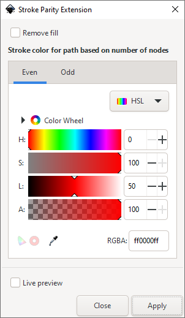

A more complex example: reading path data and changing the style 
================================================================

.. note:: 
    This tutorial builds on the files created in :ref:`first-effect-extension`.

Resources
---------

-  :download:`Example solution <resources/stroke_parity_extension.zip>`

Introduction
------------------

We are going to write an effect extension that will change any path with
an even number of nodes to a user-defined stroke and any path with an odd
number of nodes to a different user-defined stroke color. 

From :ref:`first-effect-extension`, we already know how to create the extension boilerplate 
(without parameters), how to iterate over the selection and how to modify the style. 

This extension adds two more things: Paths and Parameters.

Setting up the inx file
-----------------------

Duplicate the files from the `make_red_extension`, and change all the filenames, class names 
and extension ID to `stroke_parity_extension`.

Now for the parameters for the colors. We're also going to add a checkbox to remove the fill of the
selected paths. The params are defined after ``<id>`` and before ``<effect>`` in the inx file:

.. code:: xml

    <param name="remove_fill" type="bool" gui-text="Remove fill">false</param>
    <label appearance="header">Stroke color for path based on number of nodes</label>
    <param name="tab" type="notebook">
        <page name="even" gui-text="Even">
            <param name="even_color" type="color" gui-text="Even stroke color:">4278190335</param>
        </page>
        <page name="odd" gui-text="Odd">
            <param name="odd_color" type="color" gui-text="Odd stroke color:">65535</param>
        </page>
    </param>

The default colors are defined as content of the ``<param>`` element, and they are passed as 
integers in RGBA format, so for a "red" color (i.e. ``#ff000ff``), one has to write 
``256^3*255 + 255 = 4278190335``.

Color widgets are quite large, so the two widgets are added in a notebook (i.e. two tabs). 

You can also change the submenu the extension will be listed in to ``Modify Path``.

Restart Inkscape. If you click the extension in the menu, it should look something like this:

Adding the parameters to the python file
----------------------------------------

When Inkscape calls the extension in the current state, an error message is shown::

    usage: stroke_parity_extension.py [-h] [--output OUTPUT] [--id IDS]
                                  [--selected-nodes SELECTED_NODES]
                                  [INPUT_FILE]
    stroke_parity_extension.py: error: unrecognized arguments: --remove_fill=false --tab=even --even_color=4278190335 --odd_color=65535

We also have to tell the ``MakeRedExtension`` class how to parse the parameters. This is done in the
:func:`~inkex.base.InkscapeExtension.add_arguments` method. We have four parameters: the two colors,
the checkbox and the currently selected tab.

.. code:: python

    def add_arguments(self, pars):
        pars.add_argument("--even_color", type=inkex.Color, default=inkex.Color("red"))
        pars.add_argument("--odd_color", type=inkex.Color, default=inkex.Color("blue"))
        pars.add_argument("--remove_fill", type=inkex.Boolean, default=False)
        pars.add_argument("--tab", type=str, default="stroke")

In ``effect``, these parameters are available as e.g. ``self.options.even_color``. 

.. hint::

    :func:`inkex.Boolean <inkex.utils.Boolean>` and :class:`inkex.Color <inkex.colors.Color>` are 
    special types that preprocess the parsed parameter, so that ``self.options.even_color`` is an 
    :class:`inkex.colors.Color` object and not the string ``"4278190335"``.

Processing the paths
--------------------

Modify the ``effect`` method as follows:

.. code-block:: python
   :linenos:

   def effect(self):
       for elem in self.svg.selection.filter(inkex.PathElement):
           elem.set('inkscape:modified_by_tutorial', 'Yes')
           elem.style['stroke-width'] = 2.0
           if len(elem.path) % 2: # odd number
               elem.style.set_color(self.options.odd_color, 'stroke')
           else:
               elem.style.set_color(self.options.even_color, 'stroke')
           
           if self.options.remove_fill:
               elem.style["fill"] = None

Code Explanation
~~~~~~~~~~~~~~~~

Firstly, we need to loop through each of the selected paths. We already now how to do this
from the first tutorial, but we now filter the selection to only contain 
:class:`~inkex.elements._polygons.PathElement` objects - since we want to count the number of nodes.
If other objects, such as a text object or rectangle, are selected, they are ignored. So, for each
iteration of the loop, ``elem`` will contain one of the selected path
objects.

The second line sets an attribute ``inkscape:modified_by_tutorial`` on
the xml element ``elem``. The attribute API will handle the ``inkscape``
namespace for us, so we can use a simple colon to indicate the
namespace. This is how all non-special attributes are set and gotten.
But on top of this simple API we don’t have to worry about parsing the
path, transform or the style attributes. Instead the inkex API does all
the parsing for us and provides us with a way to change styles, modify
paths and even do transformations without manual parsing.

Then we set a stroke-width of 2, using the standard style API which is
assigning into a type of ordered dictionary.

Next we use the Path API to get the path data of the element, using 
:attr:`~inkex.elements._base.ShapeElement.path`. This is an :class:`inkex.paths.Path` object, 
which is a list of all path commands (such as Moveto, Lineto, Curveto...). We can use the length
of the list to determine the number of segments, which is (for the simple case of open paths) equal
to the number of nodes.

We then use the Color API to assign the correct stroke color. The parameters are passed in RGBA format,
and we can use the :func:`~inkex.styles.Style.set_color` function to set opacity and stroke at the same time.
Stroke and stroke opacity are two different style properties, so we can’t set them with a simple
assignment.

Last we set the fill to ``None`` (``"none"`` would work as well) - if the checkbox for this is 
checked.

Testing the extension
---------------------

As we've already learned, there’s no need to set, save or do anything else as we’ve
modified the style in place.

Save your python script, and re-launch Inkscape. If inkscape was already
open, close it first. You should find your new extension available in
the ``Modify Path`` menu.

Draw some shapes with the pen tool, select some of the shapes and use the extension. 
You should see the stroke color change for each of the objects selected.

.. note::
    For closed paths, the extension gives incorrect results, because the closing "Z" / "z"
    command does not add a new node, but is counted by ``len(path)``. 

    This can be avoided by manually counting segments except that are not ZoneClose (zoneClose) commands.

